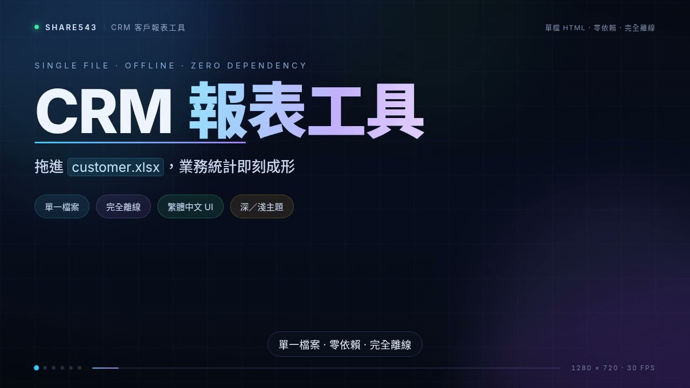

# CRM 客戶報表工具

單檔、零依賴、完全離線的 CRM 業務開發報表工具。拖曳或選取 `customer.xlsx`，在瀏覽器中即時產生業務統計、漏斗、排行與可篩選明細，支援**依週／月份／季度／年度**切換分析期間，並可 CSV 匯出與列印 PDF。

## 線上使用

GitHub Pages：<https://share543.github.io/crm-report/report.html>

## 介紹影片

[](https://share543.github.io/crm-report/intro.html)

53 秒的影片導覽（中文字幕＋旁白）：**點封面圖**到播放頁觀看（有完整播放條）。

- 播放頁：<https://share543.github.io/crm-report/intro.html>
- 影片檔：`media/intro.mp4`（1280×720、H.264 + AAC、約 8.5 MB）
- 封面：`media/intro-poster.jpg`（六幕分鏡＋播放鍵）

> ⚠️ **為什麼 README 裡沒有播放器？** GitHub 的 README 會把 `<video>` 標籤整段過濾掉
> （實測：`<video src=…>` 與 `<video><source …></video>` 兩種寫法都只剩空段落），
> 所以 markdown 只能放圖片連結。要真正的播放條就進上面的播放頁 `intro.html`。

> 影片是**外加的展示素材**，不影響 `report.html`：它仍然是零依賴單檔，完全離線可用、不含任何影片資源。

## 特色

- **單一檔案**：HTML + CSS + JS 全部內嵌在 `report.html`，無任何外部資源。
- **完全離線**：不使用 CDN、不引入任何 JS 框架，全部原生 Web API。
- **本機開啟即用**：直接雙擊 `report.html`（`file://`）即可，不需安裝或架設伺服器。
- **繁體中文 UI**，支援深色／淺色主題切換。
- **分析期間**：以 `填單日期` 為錨點，支援本週／上週／本月／上個月／本季／本年度／去年與自訂起訖月份，所有區塊同步縮放。
- **可篩選明細**：課別／狀態／開發者／類別下拉＋關鍵字搜尋，可與期間疊加套用。
- **進度追蹤表**：先「依類別」再「依課別」兩張交叉表（列＝類別／課別，欄＝填單→…→導入→合作結案），每格計數＋迷你轉化長條（以該群組填單數為分母），可一眼比較各群組到結案的推進情形。
- **開發時間分析**：以里程碑日期差值計算各階段天數（填單→…→導入，樣本數／平均／中位數／最短／最長）；**總時程分布**（填單→導入）與「各階段平均天數」**左右兩欄併排**——左欄總時程每區間可點整列展開客戶清單，每張客戶卡附**各階段落差 mini 表**（一眼看卡在哪環節），右欄為各階段平均天長條圖。
- **各課追蹤簡表**：課別 × 甲指／甲配／零擔 一覽（甲指＝1P(SCM)＋3P(MO+)），每欄顯示「新增（本期填單）」與「開發累計」，底部附「加總」與「已導入累計」；新增隨分析期間縮放，開發累計／已導入累計為全量。
- **未啟動案件追蹤表**：列出**已填「填單日期」但狀態為「未啟動」**的案件（已進名單但尚未開始接觸）。**課別堆疊橫條**：一列一課別，長條內堆疊類別（顏色區分），課別依**總計多→少**排列，長條以最大值為 100%；表頭為課別／類別組成／總計。**預設全部收攏**，點任一列才展開該課別的案件清單（按類別分小節，公司名稱、填單日期、開發者），案件可再點開明細（統一編號、公司名稱、站所、開發者、填單日期）。**不隨分析期間與篩選縮放**，固定顯示全部符合條件者。
- **洽談時間線**：案件明細展開時，會把 `洽談內容` 依日期（`M/D`、`M月D日`）拆成時序卡片，未註記日期的片段歸入「未註記」。
- **站所多值拆分**：一客戶可能跨多站所（`收貨站所` 以 換行／斜線 分隔），站所排行／開場亮點會把該客戶**各站所各計 1 筆**，明細仍顯示原始字串。
- **資料自動整理**：所有文字欄進模型時去除首尾空白（解決 `廖怡菁↵`、`↹張黌恩` 這類髒值）；日期欄的自由文字日期（如 `8/27 mail`）會以同列 `填單日期` 年度補成 `YYYY-MM-DD`，確保「有日期即算該里程碑發生」。
- **待留意事項**除類別規則／時程過長／停滯外，另提示**非未啟動案件的資料缺漏**（開發者／聯絡窗口／收貨站所未填）。
- **待留意事項可以直接跳到案件**：每筆被點名的公司名稱都是連結，點了會自動**翻到案件清單的正確頁碼 → 捲到那一列 → 閃一下高亮 → 展開洽談內容**。同一類超過 5 筆時以「**…等 N 筆（點開）**」在卡片內就地展開（不會動到其他區塊的篩選與統計）。
- **反向也通**：案件清單裡被點名的列有 **⚠** 記號（滑過顯示原因，點了跳回待留意事項並高亮該筆）；進度追蹤表的課別旁有 **⚠N**（該課有幾筆要留意，點了跳回並高亮該課全部項目）。**存成圖片與列印時連結會還原成純文字、⚠ 按鈕自動隱藏**，版面上不會出現藍字底線；簡報模式下點連結會直接切到「案件清單」那一頁。
- **自動記憶**：載入資料後會記入瀏覽器 `localStorage`，下次開啟 `report.html` 自動還原上次資料與檢視（期間／篩選回到全部），載入新檔案即覆蓋；可點「清除記憶」移除。
- **存檔（含資料）**：一鍵輸出**內嵌目前資料的 `report-含資料.html` 副本**，可複製到任何裝置／瀏覽器離線開啟即見上次資料（不依賴瀏覽器儲存，`file://` 也穩定）。
- **區塊存成圖片**：每張卡片右上角「**⬇ 存圖**」按鈕，把該區塊（含目前主題配色與所套用的期間／篩選）**離線輸出為 PNG**（SVG `<foreignObject>` 原生渲染，零依賴），可用於貼進簡報／文件。彈窗可**即時預覽**，並選**解析度 1x／2x**、**背景（隨主題／白色／透明）**；按「下載 PNG」或「複製圖片」（Chrome/Edge 剪貼簿圖片，可直接貼上）。檔名自動帶區塊名、解析度與期間（如 `漏斗分析@2x-本月.png`）。建議以 Chrome/Edge 使用。
- **簡報模式**：開會投影用，工具列「開始簡報」進入**全螢幕投影片**，一次一個區段，`←/→`／空白／`PgUp/PgDn` 換頁、`Home/End` 跳頭尾、`Esc` 結束；底部工具列可**即時切換分析期間**（整份報表同步縮放），`D` 鍵可直接操作期間下拉。可點「**頁面 ✎**」勾選要列入簡報的區段（預設全勾、至少保留一頁），勾選設定**隨自動記憶與存檔副本保存**。**排行分析**在簡報中自動拆成**三張投影片**（開發者／課別／站所各一頁），每張只顯示**前 10 名**，避免超出單一畫面；一般檢視維持完整列表。
- **隨時跳到「案件清單」**：每張卡片右上角（「⬇ 存圖」左邊）都有「**☰ 案件**」，不論捲到哪裡都能一鍵前往案件清單 —— 不用再一路往下捲。跳轉**保留目前的篩選與頁碼**，不會偷偷改掉你設好的條件。**案件清單自己不放**這顆按鈕（跳自己沒意義），其餘區塊都有。
- **回跳原區塊**：跳到案件清單後，標題列會出現「**← 回到『○○○』**」（寫明來源區塊名）；再往下捲讓標題列離開畫面時，右下角會出現**浮動膠囊**「← 回到『○○○』」，捲回頂端即自動收起 —— **同一時間只會有一個返回入口**。沒有跳轉過來時兩個控制項都不會出現。被收合的區塊（來源或目標）會在跳轉／回跳時自動展開並閃一下高亮。與「待留意事項點公司名稱直接跳到那一筆」是**互補的兩種跳法**：前者泛用瀏覽、後者精準定位。**列印 PDF、簡報模式、存成圖片三處都會自動隱藏**這兩個控制項。
- **會議用雷射筆**：頂部「**◎ 雷射筆**」開啟後，內容區會出現一個跟著滑鼠跑的**粉紅空心光點**（中心粉點），讓與會人員清楚看到你指的地方；移到表格上時**整列會被框起來並加上中性色底**（不影響任何儲存格原本的底色與分組顏色），點一下還會**放大一圈光圈**。**快速鍵 `L`** 隨時開關；**進入簡報模式自動開啟**，離開即恢復你原本的設定（設定會記住）。**預設關閉**，日常作業零干擾。列印 PDF、存成圖片都會自動排除。
  > 為什麼不是改鼠標外觀：**遠端會議的螢幕分享常常不傳送真正的滑鼠指標**（Zoom 官方說明分享畫面不含游標；Teams 在 Mac／Linux 亦同），而且自訂鼠標圖有大小上限。所以改用「網頁自己畫的光點」——它會被燒進分享畫面，投影機與任何會議軟體都看得到。
- **列印設定面板**：按「列印」不直接列印，先開設定面板，可 (1) **勾選要列印的區塊**（14 個，預設全勾，附全部勾選／全部取消；全不選則不列印），(2) **選擇列印版型**（跟隨畫面／手機／桌面），(3) **選擇案件清單範圍**（當前頁／全部符合條件的案件）。設定**隨自動記憶與存檔副本保存**，下次開啟沿用。與「簡報模式」的頁面勾選**各自獨立**，互不影響。
- **本日議題**：獨立卡片（位於開場亮點之前、**簡報第 1 頁**），可放自訂大綱／議題；一般檢視點「✎ 編輯議題」輸入後按「儲存」定案，內容為空時顯示「＋ 新增本日議題」入口；議題**隨「存檔（含資料）」副本與自動記憶一起保存**，載入新檔案不被覆蓋，「清除記憶」或「清除議題」才會移除。
  - **層級化語法**（行首符號決定層級，一行一項）：`#` 大項（自動編號 1. 2. 3.）／`-` 項目／`*` 重點（黃色★）／`**` 次重點（縮排）／`>` 說明（灰色小標籤）；行內 `_文字_` 為粗底線。**無符號＝大項**，舊資料（含自己打了 `1.`／`一、`／`(2)` 的）自動相容並去掉手動編號，不需重新輸入。
  - **編輯器**：工具列 6 顆按鈕（大項／項目／重點／次重點／說明／底線）在游標所在行首插入符號（可反覆切換層級、不疊加；底線按鈕把選取文字前後包 `_`）、**常駐語法說明**、**即時預覽**；按 Enter 會沿用上一行的符號方便連續輸入（該行只有符號時 Enter 則結束該層）。全形 `＃－＊＞` 也接受。
  - 投影第 1 頁依層級放大（大項 32px／項目與重點 25px／次重點 21px／說明 17px），內容全部保留；列印時編輯器與「新增議題」按鈕不會進 PDF。卡片為兩欄：**右欄「開會資訊」**即時顯示本份數據的分析期間與案件件數，並附**新增動向迷你折線圖（sparkline）**（分箱粒度隨期間跨度動態切換：週/月→每日、季→每週、年→每月、全部/自訂依資料跨度挑；只畫到今天；底軸標籤隨單位變，如「一二三四五六日」／日期數字／月初／月份），隨期間同步更新，簡報第 1 頁也一併呈現。

- **手機版型**：視窗寬度低於 700px 自動切到**手機版**（卡片式各課簡表／進度表、手風琴收合、sticky 工具列、14px 基準字級）；手機「**分析期間**」按鈕自動**換行**絕不超出區塊，寬度回桌即還原桌面表格。工具列「**版型**」鈕可手動在 **自動／手機／桌面** 之間切換（點一下換一種），選擇會**自動記憶**（載入新檔自動還原）；手機版重排由 CSS＋純函式處理，桌面版表格原樣保留，不影響桌面檢視。
## 使用方式

1. 下載 `report.html`，用瀏覽器開啟。
2. 拖曳或點選載入 `customer.xlsx`（備援格式：`.csv`）；先前載入過的資料會在開啟時**自動還原**（工具列可「清除記憶」）。載入區塊是**一行式**（標題・或・按鈕同一行，空狀態約 89px、載入後約 140px），不佔首屏空間；窄螢幕會自動換行。
> 「開場亮點摘要」= **現況存量 ＋ 標竿排行榜**（進行中／未啟動、誰最好、主要流失在哪），
> 供不開會時瀏覽。**它是主報表的一個區塊。**
> 全期累計數字（全期累計 N 件）放在它的卡片副標，避免與焦點數字重複。

3. **講者版**（工具列「講者版」按鈕，在「開始簡報」右邊）：產生一份**主持人專用的單檔講稿**。
   會議時簡報電腦分享同一個畫面、與會者看的是主報表／簡報，主持人手上的提示不能出現在那個畫面上，
   所以另外產生一份**可攜單檔**（手機／平板可離線開啟）。
   - 內容：數字帶（手機 2×2）＋「要決定／要注意／值得肯定」最多 5 條 ＋ 類別／課別細部
   - 一鍵切換**講稿模式**（每句都能直接唸，附「→ 追問」提示）
   - 深色為預設、手機寬度優先、無操作雜訊（沒有存圖／跳轉／列印）
   - **重點分析不在主報表的流程中**（不顯示、不列印、不投影），只由這個按鈕產生
4. 立即產出報表：總覽統計、里程碑漏斗、**各課追蹤簡表**、**進度追蹤表**、圖表、開發者／課別／站所排行、可篩選明細表。
6. 點擊案件明細列可展開「洽談內容」全文與**洽談時間線**卡片。
7. 如要看特定區間，用「分析期間」切換本月╱本季╱本年度，或選自訂起訖月份；檢視徽章會顯示目前期間與筆數。
8. 支援 CSV 匯出與列印 PDF。列印前會開**列印設定面板**，可勾選要列印的區塊並選列印版型（跟隨畫面／手機／桌面）；列印會帶上目前期間徽章。
9. 點「存檔（含資料）」下載嵌入了目前資料的 `report-含資料.html`，之後直接開啟該檔即可離線檢視同樣報表。
10. 開會投影：載入資料後點工具列「開始簡報」進入全螢幕投影片（`←/→` 換頁、`Esc` 結束），底部工具列可在簡報中直接切換分析期間。

> 解析在瀏覽器端完成，資料不會上傳任何伺服器。若瀏覽器在 `file://` 下停用 `localStorage`，「自動記憶」會自動停用（報表仍正常），此時可改用「存檔（含資料）」的內嵌副本攜帶資料。

## 支援檔案

- 主格式：`.xlsx`（瀏覽器原生解壓 `xl/` 內部 XML，不依賴第三方函式庫）。
- 備援格式：`.csv`（UTF-8）。

## customer.xlsx 欄位說明

表頭共 25 個欄位（解析以**表頭名稱**對應欄位，欄位順序可調動）：

| 欄位 | 格式 | 說明／範例 |
|------|------|-----------|
| `序號` | 數字 | 流水號，每筆由 1 起跳 |
| `客代` | 文字 | 客戶代碼，如 `TP0005662`；未建代為 `-` |
| `統編` | 數字 | 統一編號，如 `54873430`，可空白 |
| `公司名稱` | 文字 | 客戶公司名稱 |
| `收件地址` | 文字 | 收件地址 |
| `聯絡窗口` | 文字 | 聯絡人姓名 |
| `聯絡電話` | 文字 | 電話（可能多組／含分機） |
| `聯絡信箱` | 文字 | Email |
| `開發者` | 文字 | 業務代表姓名（用於開發排行） |
| `課別` | 文字 | 業務課別，值域：`北一課`／`北二課`／`北三課`／`南一課`／`南二課`／`中課` |
| `收貨站所` | 文字 | 站所代碼，如 `Kt2`、`NS2`、`SS3`、`TS1`、`CS3`；一客戶跨多站所時以 換行／斜線 分隔（如 `Tt6↵St5↵St6↵KS3`），站所排行會各計 1 筆 |
| `日均量體` | 文字 | **現況**：自由文字，如 `非檔期5~10件/天` 或 `20`。**即將改為下拉選單**（見下節） |
| `預估營收/月` | 數字 | 預估月營收（目前樣本無資料） |
| `商品類別` | 文字 | 商品描述，如 `服飾`、`食品`、`寵物貓砂` |
| `填單日期` | Excel 序列日期 | 填單日（約 `46xxx`，報表自動轉成 `YYYY-MM-DD`） |
| `初步接洽` | Excel 序列日期 | 首次接洽日 |
| `需求確認` | Excel 序列日期 | 需求確認日 |
| `報價` | Excel 序列日期 | 報價日 |
| `簽約` | Excel 序列日期 | 簽約日（`零擔`／`甲配` 才填，`1P`／`3P` 留空） |
| `導入` | Excel 序列日期 | 導入日（`1P`／`3P` 只填此欄） |
| `結案` | 文字（可多行） | 結案原因，用於判定案件狀態，範例見下方 |
| `說明` | 文字 | 額外備註，不作為狀態判定 |
| `洽談內容` | 自由文字 | 逐次洽談紀錄（日期＋過程），核心分析欄位 |
| `類別` | 文字 | 值域：`零擔`／`1P(SCM)`／`3P(MO+)`（`甲配` 暫未出現） |
| `甲指成功轉甲配` | 文字 | 標記用（目前樣本無資料） |

### 列印設定（區塊勾選、版型、案件清單範圍）

按工具列「**列印**」不直接列印，先開**列印設定面板**：

**1. 區塊勾選**

14 個可列印區塊，**預設全勾**，附「全部勾選」／「全部取消」：

| 區塊 | | 區塊 |
|---|---|---|
| 本日議題 | | 案件類型分析 |
| 待留意事項 | | 漏斗分析 |
| 開場亮點摘要 | | 排行分析 |
| 案件狀態統計 | | 開發時間分析 |
| 各課追蹤簡表 | | 轉換流失分析 |
| 未啟動案件追蹤表 | | 案件清單 |
| 進度追蹤表 | | 原始資料預覽 |

> 「載入」與「分析期間」為控制用區塊，不列入勾選。

- 未勾選的區塊**不會出現在 PDF**。
- **全部取消時不會列印**，面板保持開啟。
- 勾選**不影響畫面顯示**，只在列印時排除。

**2. 列印版型**

| 選項 | 說明 |
|---|---|
| **跟隨畫面**（預設） | 依目前畫面版型列印（在手機上按列印就印手機版） |
| **手機** | 強制以手機版型列印（寬表改卡片、版面較長） |
| **桌面** | 強制以桌面版型列印（寬表維持表格） |

> 指定版型時，程式會**暫時**切換版型並重繪「各課追蹤簡表」「進度追蹤表」兩個寬表，列印後**自動還原**畫面版型，不影響你當下的檢視設定。

**3. 案件清單範圍**

| 選項 | 說明 |
|---|---|
| **當前頁**（預設） | 只列印畫面目前顯示的那一頁（與畫面相同，PAGE_SIZE=50） |
| **全部** | 列印**所有符合條件**的案件（自動展開分頁，PDF 會較長） |

> 只影響列印。**畫面一律維持分頁**，列印後會自動還原你原本所在的頁碼。

**4. 記憶**

勾選、版型與案件清單範圍會**隨「自動記憶」與「存檔（含資料）」副本一起保存**，下次開啟沿用；按「清除記憶」才會重設為全勾＋跟隨畫面＋當前頁。

> **與簡報模式各自獨立**：列印勾選（`printEnabled`）與簡報頁面勾選（`presentEnabled`）是兩套設定，改一處不影響另一處。

### 列印 PDF 的內容

PDF 只包含**列印專用大標題**與**你勾選的區塊**，操作型 UI 一律不出現：

- 不出現：頁首標題與副標題、載入區資訊、匯入進度、分析期間控制項
- 列印專用大標題：**業務開發進度報表**（畫面上不佔空間，僅列印時顯示）

**警示標記在紙上仍可辨識**（畫面上靠互動、紙上靠靜態標記）：

| 標記 | 畫面 | 列印 |
|---|---|---|
| 案件清單 ⚠ | 可點，hover 顯示原因 | 保留（靜態符號） |
| 進度追蹤表 ⚠N | 可點 | 保留（靜態符號） |
| 嚴重程度 | 左側 4px 色條 | 色條＋**文字標籤**（錯誤／提醒／資料） |
| 欄位級問題 | 該欄加底色 | 該欄加底色（如「導入」欄） |

> 列印一律使用**淺色主題的深色色票**（深紅／深黃／深藍），不受你目前使用的主題影響，確保白紙上清晰。

### 日期欄位格式

- `填單日期`、`初步接洽`、`需求確認`、`報價`、`簽約`、`導入` 六欄為 Excel **序列日期**（1899-12-30 起算的天數，約 `46xxx`），報表會自動轉為 `YYYY-MM-DD`。
- 「有日期」即代表該里程碑已發生；空白代表未發生。
- **容錯**：日期欄若誤填自由文字日期（如 `8/27 mail`、`9/14 電聯未接`），會以同列 `填單日期` 的年度補成年份後解析（跨年邊界不推斷，維持同年）。
- 所有文字欄（含表頭）在進模型時自動去除首尾空白。

### `日均量體` 欄位（即將改為下拉選單）

**現況**：自由文字（如 `非檔期5~10件/天`、`20`），無法加總。

**即將改為**下拉選單，值域：

| 級距（件/工作日） | 說明 |
|---|---|
| `≤10` | 10 件以下 |
| `11-50` | |
| `51-100` | |
| `101-200` | |
| `201+` | 201 件以上（無上限） |

> **定義**：`日均量體` 指**每工作日**平均件數，月以 **22 工作日**計。

#### 對現行報表的影響：**無**

`日均量體` 目前**未被報表程式引用**（不在任何計算或顯示欄位中），因此改為下拉選單**不需要同步修改 `report.html`**。

經真實 Chromium 實測（2026-10），以下情境皆正常載入且完整渲染（`parseXlsx` → `applyModel` → `rebuild` 零錯誤）：

| 情境 | 結果 |
|---|:-:|
| 改動前（自由文字） | ✅ |
| 改動後（下拉選單值） | ✅ |
| 課別／類別同時為下拉 | ✅ |
| 下拉清單**參照另一工作表** | ✅ |
| 含**空白值**（未填） | ✅ |

**技術原因**：Excel 的下拉選單只是「輸入限制」，儲存格本身仍是普通字串；`readSheetMatrix()` 讀取的是**儲存格值**，不涉及 `dataValidations` 驗證規則。

#### 行政改動注意事項

1. **存成 `.xlsx`**（勿用 `.xls`），確保 UTF-8 編碼
2. **下拉清單若另存工作表，該 sheet 名不要叫 `2026總表`**（`parseXlsx` 會優先選取此名稱的工作表）
3. `≤10` 的 `≤` 為 U+2264；若遇編碼問題可改用 `10以下`

#### ⚠️ 改動前必須先做：檔期資訊搬移

現有自由文字含**檔期資訊**（如 `非檔期5~10件/天`）。改為下拉選單後，此資訊將無處存放。

**轉換前必須先將檔期等補充資訊搬移至 `備註` 欄**，否則將永久遺失。

### `預估營收/月` 欄位

| 項目 | 說明 |
|---|---|
| 格式 | 數字 |
| 現況 | 樣本無資料 |
| 用途 | **保留供業務自行記錄**，不納入報表計算、不顯示於報表 |

> 開發價值評估改以 `日均量體` 級距衍生，不使用本欄位。詳見《富昇物流_CRM開發價值評估_L2規格_v1.0》。

### `結案` 欄與案件狀態對應

| 結案內容 | 狀態 |
|----------|------|
| `導入完成 結案` | 合作結案 |
| `客戶婉拒 故先結案` | 客戶婉拒 |
| `五日三聯皆失敗 故先結案` | 聯繫失敗 |
| `客戶考慮中 故先結案` | 考慮中／暫緩 |
| `客戶需求無法滿足 故暫緩開發，結案` | 需求無法滿足 |
| `結案` 空白、`洽談內容` 有進度，或 `初步接洽` 已有日期 | 進行中 |
| `結案`／`洽談內容` 空白**且 `初步接洽` 也未填** | 未啟動 |

### 載入注意事項

- 僅含序號、其他欄全空的樣板列會被自動過濾。
- 載入區塊維持**一行式**；它是 flex ＋ `gap` 排版，改文字或字級不會需要動座標。
  ⚠ 新增訊息列（如 `#fileName`、`#memoryRow`）時要顯式寫 `margin` —— `<p>` 的預設 1em 外距在這種版面是主要的高度來源。
- 資料在瀏覽器端解析，不會上傳任何伺服器。

### 分析期間（週／月度／季度／年度）

- 以 **`填單日期`**（客戶進場時間）為錨點；同一客戶不會被算到多個期間。
- **快捷 chip**：全部數據／本週／上週／本月／上個月／本季／本年度／去年。
- 本週／上週以**自然週（週一為起點）**定位，需 `填單日期` 含完整日期（`YYYY-MM-DD`）才計入。
- **自訂區間**：起訖月份選單（`YYYY-MM`），也可只填起或只填訖（開放端）。
- 期間可與 課別／狀態／開發者／類別／關鍵字 篩選**疊加**，同步套用於所有區塊、案件清單與 CSV 匯出。
- 檢視徽章顯示目前期間與筆數（如「目前檢視：2026 Q3（7–9 月）｜共 24 筆／全部 97 筆」），列印時一併輸出。
- 期間有效時，無 `填單日期` 的列會被略過，並以「已略過 N 筆無填單日期的列」註記說明。

## 領域規則（來自使用者）

- 里程碑日期欄（有日期即代表該階段發生）：`填單日期` → `初步接洽` → `需求確認` → `報價` → `簽約` → `導入`。
- `簽約`／`導入` 填寫規則依 `類別`：
  - `零擔`／`甲配` → `簽約` 與 `導入` 都有日期。
  - `1P`／`3P` → `簽約` 空白、`導入` 有日期。
- 案件狀態依 `結案` 欄文字判定（合作結案／婉拒／聯繫失敗等）；`結案`／`洽談內容` 皆空時，只要 `初步接洽` 有日期即視為`進行中`，`初步接洽` 也未填才算`未啟動`。
- `洽談內容` 為核心分析欄位，支援展開全文、關鍵字搜尋與洽談時間線（明細展開時以日期拆解為時序卡片）。
- **案件清單欄位顯示切換**：預設為「**會議精簡**」9 欄（序號／公司名稱／課別／開發者／類別／收貨站所／填單日期／導入／狀態），開會可直接讀完不必橫向捲；點「**欄位 ⚙**」可勾選顯示的欄位、或以「會議精簡／完整」快速切換，簡報中按 `1`＝精簡、`2`＝完整。勾選設定**隨自動記憶與存檔副本保存**。
- 站所排行遇 `收貨站所` 多值（換行／斜線分隔）時各站所各計 1 筆。
- 「待留意事項」會提示非未啟動案件的資料缺漏（開發者／聯絡窗口／收貨站所未填），避免影響排行完整性。

## 開發

```bash
git clone git@github.com:share543/crm-report.git
```

直接編輯 `report.html` 即可，無建置步驟。